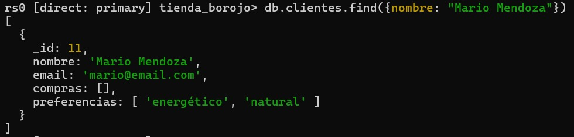

# La Tienda del Borojó

## Descripción del Proyecto y del Escenario

Este proyecto simula la gestión de una pequeña tienda especializada en productos derivados del borojó. Se utilizan varias colecciones (productos, clientes, ventas, proveedores, inventario) para gestionar información sobre los artículos disponibles, los clientes, el historial de ventas, los proveedores y el control de existencias. El objetivo es aplicar diversas operaciones de MongoDB, incluyendo inserción, lectura, actualización, eliminación, consultas avanzadas con expresiones regulares y operadores de arrays, el uso del Aggregation Framework, funciones definidas en el lado del servidor, transacciones para operaciones críticas e indexación para optimizar el rendimiento de las consultas.

## Instrucciones para Ejecutar los Scripts o Cargar el Dataset

Para ejecutar este proyecto, sigue los siguientes pasos:

### 1. Configuración de MongoDB

* **Instala MongoDB:** Si aún no tienes MongoDB Server y `mongosh` instalados, hazlo. Puedes encontrar las instrucciones oficiales en el sitio web de MongoDB.
* **Inicia el servidor de MongoDB (mongod) como un Replica Set (¡CRÍTICO para Transacciones!):**
    * **Abre una ventana de Símbolo del sistema (CMD) o PowerShell como Administrador.**
    * **Asegúrate de que la carpeta de datos exista:** Si no tienes `C:\data\db`, créala usando el Explorador de Archivos o el comando `mkdir C:\data\db` en una terminal con permisos de administrador.
    * **Navega al directorio `bin` de tu instalación de MongoDB Server.** Por ejemplo:
        ```bash
        cd "C:\Program Files\MongoDB\Server\8.0\bin"
        ```
        (Ajusta la ruta si tu versión o ubicación es diferente. Tu `mongod.exe` debería estar allí).
    * **Inicia `mongod` con el replica set:**
        ```bash
        mongod --port 27017 --dbpath C:\data\db --replSet rs0
        ```
        **Deja esta ventana abierta.** Es tu servidor MongoDB.
* **Inicializa el Replica Set:**
    * **Abre una *nueva* ventana de Símbolo del sistema (CMD) o PowerShell (normal, no administrador).**
    * **Conéctate a `mongosh`:**
        ```bash
        mongosh "mongodb://localhost:27017"
        ```
    * **Dentro de `mongosh`, inicializa el replica set:**
        ```javascript
        rs.initiate();
        ```
        Verás un mensaje de éxito. Esto solo se hace una vez.
        **¡Importante!** Si después de esto, tienes problemas con las transacciones o si `mongosh` no se reconoce, consulta la sección de `Troubleshooting` en este mismo `README.md`.


### 2. Cargar el Dataset Inicial

* Dentro de tu carpeta `scripts/` (la que creaste en el paso anterior), crea un archivo llamado `data.js`.
* Copia el contenido necesario que se encuentra en la carpeta `data.js`:
* Carga los datos iniciales: Abre tu terminal, navega hasta la carpeta scripts/ (o donde guardaste data.js) y ejecuta:

```javascript
mongosh "mongodb://localhost:27017/tienda_borojo" --file data.js
```

* Verifica la carga de datos: Conéctate a mongosh y usa show collections; y db.productos.find().count(); para asegurarte de que los datos se cargaron correctamente.


### 3. Ejecutar Operaciones por Secciones

Ahora que los datos están cargados, puedes ejecutar los scripts para cada tipo de operación. Crea un archivo .js separado para cada sección 


## 1. Inserción
- Descripción: Añade nuevos documentos a las colecciones existentes.
- Archivo: insercion.js
- Contenido:


* Evidencia


```javascript
// Insertar un nuevo producto
db.productos.insertOne({
  "_id": 11, 
  "nombre": "Chocolatina de borojó",
  "categoria": "Snack",
  "precio": 4000,
  "stock": 35,
  "tags": ["dulce", "energía"]
});
print("Producto 'Chocolatina de borojó' insertado.");
```
* Evidencia


```js
// Insertar un nuevo cliente
db.clientes.insertOne({
  "_id": 11, 
  "nombre": "Mario Mendoza",
  "email": "mario@email.com",
  "compras": [],
  "preferencias": ["energético", "natural"]
});
print("Cliente 'Mario Mendoza' insertado.");
```

* Evidencia




## 2. Lectura
- Descripción: Recupera documentos de las colecciones según criterios específicos.
- Archivo: lectura.js
- Contenido:

```javascript
// Consultar todos los productos con stock mayor a 20
print("--- Productos con stock mayor a 20 ---");
db.productos.find({ "stock": { "$gt": 20 } }).forEach(printjson);
```
* Evidencia


```js
// Encontrar los clientes que no han comprado aún ningún producto
print("\n--- Clientes sin compras ---");
db.clientes.find({ "compras": { "$size": 0 } }).forEach(printjson);
```
* Evidencia


## 3. Actualización
- Descripción: Modifica los documentos existentes en las colecciones.
- Archivo: actualizacion.js
- Contenido:

```js
// Aumentar en 10 unidades el stock del producto "Borojó deshidratado"
db.productos.updateOne(
  { "nombre": "Borojó deshidratado" },
  { "$inc": { "stock": 10 } }
);
print("Stock de 'Borojó deshidratado' actualizado.");
```
* Evidencia


```js
// Añadir el tag "bajo azúcar" a todos los productos de la categoría "Bebida"
db.productos.updateMany(
  { "categoria": "Bebida" },
  { "$addToSet": { "tags": "bajo azúcar" } }
);
print("Tag 'bajo azúcar' añadido a productos de categoría 'Bebida'.");
```

* Evidencia


## 4. Eliminación
- Descripción: Borra documentos de las colecciones.
- Archivo: eliminacion.js
- Contenido:

```js
// Eliminar el cliente con el correo "juan@email.com"
db.clientes.deleteOne({ "email": "juan@email.com" });
print("Cliente 'juan@email.com' eliminado.");
```

* Evidencia


```js
// Eliminar todos los productos con stock menor a 5
db.productos.deleteMany({ "stock": { "$lt": 5 } });
print("Productos con stock menor a 5 eliminados.");
```

* Evidencia


## 5. Consultas con Expresiones Regulares
- Descripción: Realiza búsquedas de texto utilizando patrones.
- Archivo: consultas_regex.js
- Contenido:

```js
// Buscar productos cuyo nombre empiece por "Boro"
print("--- Productos cuyo nombre empieza por 'Boro' ---");
db.productos.find({ "nombre": /^Boro/ }).forEach(printjson);
```
* Evidencia


```js
// Encontrar productos cuyo nombre contenga la palabra "con"
print("\n--- Productos cuyo nombre contiene 'con' ---");
db.productos.find({ "nombre": /con/i }).forEach(printjson); // 'i' para insensible a mayúsculas/minúsculas
```
* Evidencia

ç

```js
// Encontrar clientes cuyo nombre tenga la letra "z" (insensible a mayúsculas/minúsculas)
print("\n--- Clientes cuyo nombre contiene 'z' ---");
db.clientes.find({ "nombre": /z/i }).forEach(printjson);
```

* Evidencia


## 6. Operadores en consultas sobre Arrays
- Descripción: Permite consultar documentos basándose en los elementos y propiedades de los arrays.
- Archivo: consultas_arrays.js
- Contenido:

```js
// Buscar clientes que tengan "natural" en sus preferencias
print("--- Clientes con 'natural' en sus preferencias ---");
db.clientes.find({ "preferencias": "natural" }).forEach(printjson);
```
* Evidencia


```js
// Encontrar productos que tengan al menos los tags "natural" y "orgánico"
print("\n--- Productos con tags 'natural' y 'orgánico' ---");
db.productos.find({ "tags": { "$all": ["natural", "orgánico"] } }).forEach(printjson);
```
* Evidencia


```js
// Listar productos que tienen más de un tag
print("\n--- Productos con más de un tag ---");
db.productos.find({ "tags.1": { "$exists": true } }).forEach(printjson);
```

* Evidencia


## 7. Aggregation Framework con Pipelines
- Descripción: Permite procesar datos en varias etapas (pipeline) para realizar operaciones complejas como agrupaciones, filtros y transformaciones.
- Archivo: aggregation.js
- Contenido:

```js
// Mostrar un listado de los productos más vendidos (suma total de unidades vendidas por producto)
print("--- Productos más vendidos ---");
db.ventas.aggregate([
  { "$unwind": "$productos" },
  {
    "$group": {
      "_id": "$productos.productoId",
      "totalVendido": { "$sum": "$productos.cantidad" }
    }
  },
  {
    "$lookup": {
      "from": "productos",
      "localField": "_id",
      "foreignField": "_id",
      "as": "productoInfo"
    }
  },
  { "$unwind": "$productoInfo" },
  {
    "$project": {
      "_id": 0,
      "nombreProducto": "$productoInfo.nombre",
      "totalVendido": 1
    }
  },
  { "$sort": { "totalVendido": -1 } }
]).forEach(printjson);
```
* Evidencia


```js
// Agrupar clientes por cantidad de compras realizadas
print("\n--- Clientes agrupados por cantidad de compras ---");
db.clientes.aggregate([
  {
    "$project": {
      "_id": 0,
      "nombreCliente": "$nombre",
      "cantidadCompras": { "$size": "$compras" }
    }
  },
  {
    "$group": {
      "_id": "$cantidadCompras",
      "clientes": { "$push": "$nombreCliente" }
    }
  },
  { "$sort": { "_id": 1 } }
]).forEach(printjson);
```
* Evidencia


```js
// Mostrar el total de ventas por mes
print("\n--- Total de ventas por mes ---");
db.ventas.aggregate([
  {
    "$group": {
      "_id": { "$month": "$fecha" },
      "totalVentas": { "$sum": "$total" }
    }
  },
  {
    "$project": {
      "_id": 0,
      "mes": "$_id",
      "totalVentas": 1
    }
  },
  { "$sort": { "mes": 1 } }
]).forEach(printjson);
```

* Evidencia


```js
// Calcular el promedio de precios por categoría de producto
print("\n--- Promedio de precios por categoría ---");
db.productos.aggregate([
  {
    "$group": {
      "_id": "$categoria",
      "promedioPrecio": { "$avg": "$precio" }
    }
  },
  { "$sort": { "promedioPrecio": -1 } }
]).forEach(printjson);
```

* Evidencia


```js
// Mostrar los 3 productos con mayor stock
print("\n--- 3 Productos con mayor stock ---");
db.productos.aggregate([
  { "$sort": { "stock": -1 } },
  { "$limit": 3 },
  { "$project": { "_id": 0, "nombre": 1, "stock": 1 } }
]).forEach(printjson);
```


* Evidencia


## 8. Funciones Definidas en system.js
- Descripción: Permite definir y almacenar funciones JavaScript directamente en la base de datos para su reutilización. Estas funciones se almacenan en la colección system.js.
- Archivo: system_functions.js
- Contenido:


```js
// Definir función calcularDescuento(precio, porcentaje)
db.system.js.save({
  _id: "calcularDescuento",
  value: function(precio, porcentaje) {
    return precio * (1 - porcentaje / 100);
  }
});
print("Función 'calcularDescuento' definida.");
```
* Evidencia


```js
// Definir función clienteActivo(idCliente)
db.system.js.save({
  _id: "clienteActivo",
  value: function(idCliente) {
    var cliente = db.clientes.findOne({ "_id": idCliente });
    if (cliente && cliente.compras.length > 3) {
      return true;
    }
    return false;
  }
});
print("Función 'clienteActivo' definida.");
```
* Evidencia


```js
// Definir función verificarStock(productoId, cantidadDeseada)
db.system.js.save({
  _id: "verificarStock",
  value: function(productoId, cantidadDeseada) {
    var producto = db.productos.findOne({ "_id": productoId });
    if (producto && producto.stock >= cantidadDeseada) {
      return true;
    }
    return false;
  }
});
print("Función 'verificarStock' definida.");
```

* Evidencia


## 9. Transacciones
- Descripción: Permite ejecutar múltiples operaciones de lectura y escritura como una única unidad atómica. Si alguna operación falla, todas se revierten. Requiere un replica set o un sharded cluster.
-Archivo: transacciones.js
- Contenido:

```js
// Simular una venta (descontar stock e insertar venta)
// Asumiendo que ya tienes un replica set iniciado (rs.initiate())
const session = db.getMongo().startSession();
const ventasCollection = session.getDatabase("tienda_borojo").collection("ventas");
const productosCollection = session.getDatabase("tienda_borojo").collection("productos");

try {
  session.startTransaction();

  const productoIdVenta = 1; // ID del producto a vender (Borojó fresco)
  const cantidadVenta = 1;
  const clienteIdVenta = 1;
  const nuevoTotalVenta = 5000 * cantidadVenta; // Precio del Borojó fresco * cantidad

  // a. Descontar del stock del producto
  const updateResult = productosCollection.updateOne(
    { "_id": productoIdVenta, "stock": { "$gte": cantidadVenta } },
    { "$inc": { "stock": -cantidadVenta } },
    { session }
  );

  if (updateResult.modifiedCount === 0) {
    throw new Error("No hay suficiente stock o el producto no existe.");
  }

  // b. Insertar la venta en la colección ventas
  const nuevaVenta = {
    "_id": db.ventas.countDocuments() + 1, // Simple ID autoincremental para el ejemplo
    "clienteId": clienteIdVenta,
    "productos": [{ "productoId": productoIdVenta, "cantidad": cantidadVenta }],
    "fecha": new ISODate(),
    "total": nuevoTotalVenta
  };
  ventasCollection.insertOne(nuevaVenta, { session });

  session.commitTransaction();
  print("Transacción de venta simulada exitosamente.");
} catch (e) {
  session.abortTransaction();
  print("Transacción de venta abortada: " + e.message);
} finally {
  session.endSession();
}

// --- Simular la entrada de nuevo inventario ---
const session2 = db.getMongo().startSession();
const inventarioCollection = session2.getDatabase("tienda_borojo").collection("inventario");
const productosCollection2 = session2.getDatabase("tienda_borojo").collection("productos");

try {
  session2.startTransaction();

  const productoIdInventario = 1; // ID del producto para aumentar stock
  const cantidadEntrada = 50;
  const nuevoLote = "L011";

  // a. Insertar un documento en inventario
  const nuevoDocumentoInventario = {
    "_id": db.inventario.countDocuments() + 1, // Simple ID autoincremental
    "productoId": productoIdInventario,
    "lote": nuevoLote,
    "cantidad": cantidadEntrada,
    "entrada": new ISODate()
  };
  inventarioCollection.insertOne(nuevoDocumentoInventario, { session: session2 });

  // b. Aumentar el stock del producto correspondiente
  productosCollection2.updateOne(
    { "_id": productoIdInventario },
    { "$inc": { "stock": cantidadEntrada } },
    { session: session2 }
  );

  session2.commitTransaction();
  print("Transacción de entrada de inventario simulada exitosamente.");
} catch (e) {
  session2.abortTransaction();
  print("Transacción de entrada de inventario abortada: " + e.message);
} finally {
  session2.endSession();
}

// --- Hacer una operación de devolución ---
const session3 = db.getMongo().startSession();
const ventasCollection3 = session3.getDatabase("tienda_borojo").collection("ventas");
const productosCollection3 = session3.getDatabase("tienda_borojo").collection("productos");

try {
  session3.startTransaction();

  const ventaIdDevolucion = 1; // ID de la venta a devolver
  const productoIdDevolucion = 1; // ID del producto en esa venta
  const cantidadDevolucion = 2; // Cantidad a devolver

  // Obtener la venta para verificar la información del producto
  const ventaADevolver = ventasCollection3.findOne({ "_id": ventaIdDevolucion }, { session: session3 });
  if (!ventaADevolver) {
    throw new Error("La venta especificada no existe.");
  }

  // a. Aumentar el stock del producto devuelto
  productosCollection3.updateOne(
    { "_id": productoIdDevolucion },
    { "$inc": { "stock": cantidadDevolucion } },
    { session: session3 }
  );

  // b. Eliminar la venta correspondiente (o actualizarla para reflejar la devolución)
  // Para este ejemplo, eliminaremos la venta completa si es la única línea
  // Si la venta tuviera múltiples productos, se actualizaría para quitar o reducir la cantidad del producto devuelto
  ventasCollection3.deleteOne({ "_id": ventaIdDevolucion }, { session: session3 });

  session3.commitTransaction();
  print("Transacción de devolución simulada exitosamente.");
} catch (e) {
  session3.abortTransaction();
  print("Transacción de devolución abortada: " + e.message);
} finally {
  session3.endSession();
}
```

* Evidencia

- NOTA IMPORTANTE: A pesar de tener el replica set configurado, este script puede presentar el error ClientSession cannot be serialized to BSON. o i?.inTransaction is not a function al ser ejecutado con --file. Esto se debe a un comportamiento inusual de mongosh en ciertos entornos. Para demostrar la funcionalidad, se recomienda ejecutar el contenido del script directamente pegándolo en la shell interactiva de mongosh si el --file falla.


## 10. Indexación
- Descripción: Crea índices en los campos de las colecciones para acelerar las operaciones de búsqueda.
- Archivo: indexacion.js
- Contenido:

```js
// Crear un índice en el campo 'nombre' de 'productos'
db.productos.createIndex({ "nombre": 1 });
print("Índice en 'productos.nombre' creado.");

// Crear un índice compuesto sobre 'categoria' y 'precio' de 'productos'
db.productos.createIndex({ "categoria": 1, "precio": 1 });
print("Índice compuesto en 'productos.categoria' y 'productos.precio' creado.");

// Crear un índice en el campo 'email' de 'clientes'
db.clientes.createIndex({ "email": 1 }, { "unique": true }); 
print("Índice único en 'clientes.email' creado.");

// Usar explain() en una consulta para mostrar si el índice de 'nombre' está siendo utilizado
print("\n--- Resultado de explain() para búsqueda por nombre ---");
db.productos.find({ "nombre": "Borojó fresco" }).explain("executionStats");
```

* Evidencia

- Nota: se ha presentado el mismo error que en el anterior punto, entonces no se pudo llegar a ejecutar con exactitud


# Trabajo echo por:
- Manuel Larrotta Meneses :D


